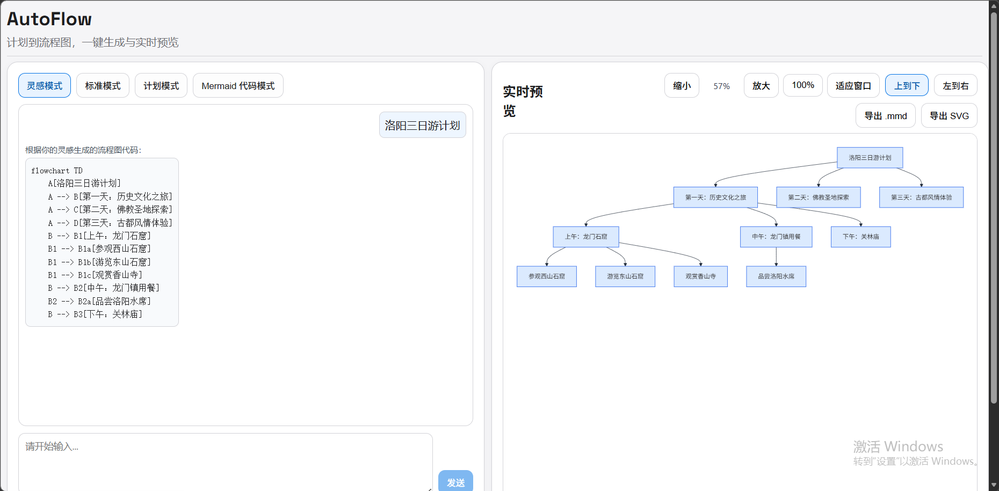
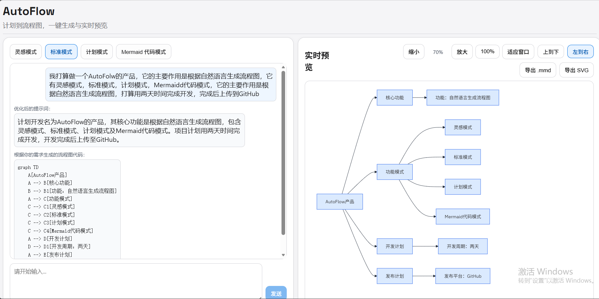

# 智能流程图生成工具(FlowLens)

> FlowLens：从自然语言到 Mermaid，将复杂信息结构化为清晰、美观的流程图。

## 📝 项目简介

FlowLens 是一个前后端分离的流程图生成项目，目标是把用户的想法、需求或计划文本，快速转换为可渲染的 Mermaid 流程图。产品名称强调“通过流程图看清信息结构”，界面采用简约科研工作台风格，帮助用户专注于输入、生成与图谱查看。

它主要解决三个问题：

- 文本到流程图转换效率低
- 手写 Mermaid 成本高、容易出错
- 流程表达缺少统一结构、可视化反馈与校验闭环

适用场景：

- 需求梳理与方案沟通
- 产品/运营流程设计
- 教学与知识结构化表达
- 项目任务流可视化

## ✨ 核心功能

- 灵感探索：输入想法，自动补全并生成流程图
- 规范生成：先整理需求描述，再生成 Mermaid 代码
- 计划模式：按行输入步骤，生成线性流程图
- Mermaid 代码模式：直接输入代码并实时渲染
- 可视化工作台：支持纵向/横向、缩放、拖拽、适应画布与 .mmd / SVG 导出
- 流程状态反馈：智能体生成期间，在画面中央以半透明流程层显示“启动、语义整理、结构生成、图谱构建、语法校验”等实时阶段，并支持取消本次请求

## 🛠️ 技术栈

- 智能体框架：HelloAgents
- 后端：FastAPI + SSE 流式返回（包含防缓冲响应头与统一异常反馈）
- 前端：React + Vite + Mermaid
- 核心能力：提示词优化、结构化生成、语法校验与修复、流式状态反馈

## 📁 项目结构

```
usernamedadad-AutoFlow/
├── backend/                    # 后端代码
│   ├── app/
│   │   ├── agents/             # 智能体模块
│   │   │   └── mermaid/        # Mermaid 生成智能体
│   │   ├── models/             # 数据模型
│   │   ├── prompts/            # 提示词模板
│   │   ├── routers/            # API 路由
│   │   ├── services/           # 业务服务
│   │   └── tools/              # 工具函数
│   ├── .env.example            # 环境变量示例
│   ├── tests/                  # 后端单元测试
│   └── requirements.txt        # Python 依赖
├── frontend/                   # 前端代码
│   ├── src/
│   │   ├── services/           # API 服务
│   │   ├── styles/             # 样式文件
│   │   ├── App.jsx             # 主组件
│   │   └── main.jsx            # 入口文件
│   ├── index.html
│   ├── package.json
│   └── vite.config.js
├── data/                       # 数据资源
│   └── images/                 # 示例图片
├── R.md                        # 项目说明
└── .gitignore
```

## 🚀 快速开始

### 环境要求

- Python 3.10+
- Node.js 18+
- npm 9+

### 安装依赖

后端（进入后端对应目录）：

```bash
pip install -r requirements.txt
```

前端（进入前端对应目录）：

```bash
npm install
```

### 配置 API 密钥

在 backend 目录创建 `.env`（可参考 `.env.example`），至少配置：

- LLM\_MODEL\_ID
- LLM\_API\_KEY
- LLM\_BASE\_URL
- LLM\_TIMEOUT

请勿提交 `.env`、API 密钥或其他敏感配置；项目已通过 `.gitignore` 排除本地环境文件。

### 运行项目

1. 启动后端（进入后端对应目录）

```bash
uvicorn app.main:app --reload --host 0.0.0.0 --port 8000
```

1. 启动前端（进入前端对应目录）

```bash
npm run dev
```

1. 浏览器打开前端地址（默认）

- <http://localhost:5173>


## 📖 使用示例

### 灵感模式示例

输入示例：

```text
洛阳三日游计划
```

效果示例：



### 规范生成模式示例

输入示例：

```text
我打算做一个 FlowLens 产品，它的主要作用是根据自然语言生成流程图，包含灵感探索、规范生成、计划模式和 Mermaid 代码模式，计划两天完成开发并上传到 GitHub。
```

效果示例：



通用操作：

1. 输入内容后点击“生成图谱”；智能体模式会在画面正中显示半透明的实时生成流程
2. 在右侧预览区切换纵向/横向，并按需缩放、拖拽或适应画布
3. 按需导出 `.mmd` 或 SVG 文件；生成中可取消当前请求

